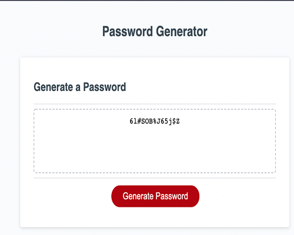

# Javascript Password Generator

## Description
This application generates a password based on user choices using a web interface. 

## Features
* Has restrictions on length. It must be at least 8 characters long and not more than 128 characters
* User can choose various options to include or leave out special characters,numbers, capital letters and lowercase letters.
* If the user does not choose any options it will display at least one option must be chosen.

## Deployment
This can be cloned using git and then run retaining the directory structure with the web server of your choice.

## Deployed example
<https://philipbrowning.github.io/javascript-password-generator/>

## Screenshots

## License
The code is available under the [MIT license](https://github.com/h5bp/html5-boilerplate/blob/master/LICENSE.txt).